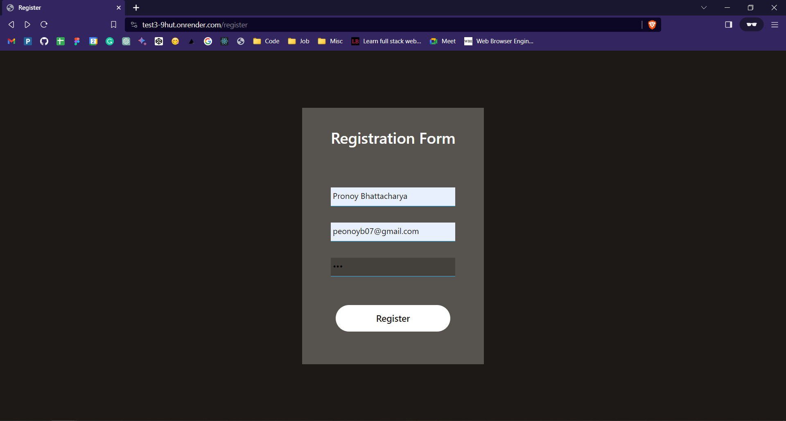
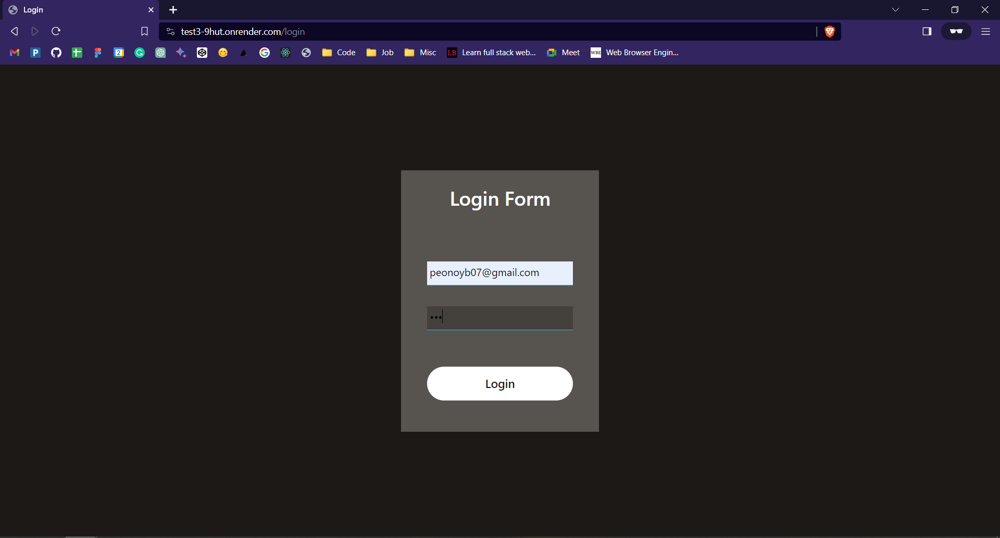
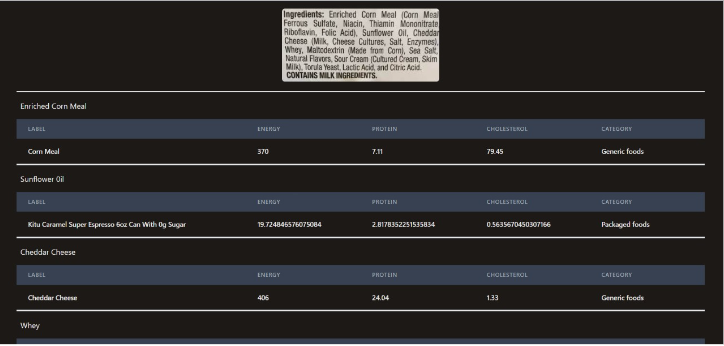

# Description

- Health Buddy is a website where you can upload scanned images of the ingredient list of any product and it will give you information about its constituents.
- It parses data using [Optical Character Recognition(OCR)](https://en.wikipedia.org/w.iki/Optical_character_recognition) through [tesseract.js](https://www.npjs.com/package/tesseract.js/v/2.1.1) and [OpenCV](https://opencv.org/+.09).
- It uses edamam API.

You can find the demo [here](https://www.loom.com/share/feef29313c124185b2b60258f3bff44c?sid=ebee98cf-f767-496e-ae68-9b66c4a42a5a)

# Step by step guide on using Health Buddy

Step 1: Create an account over [here](https://test3-9hut.onrender.com/register).

Step 2: Login yourself over [here](https://test3-9hut.onrender.com/login).

Step 3: Select any image from [Ingredient_Image_DB](https://github.com/pronoyb07/health_buddy/tree/main/Ingredient_Image_DB) and click on sumbit.

